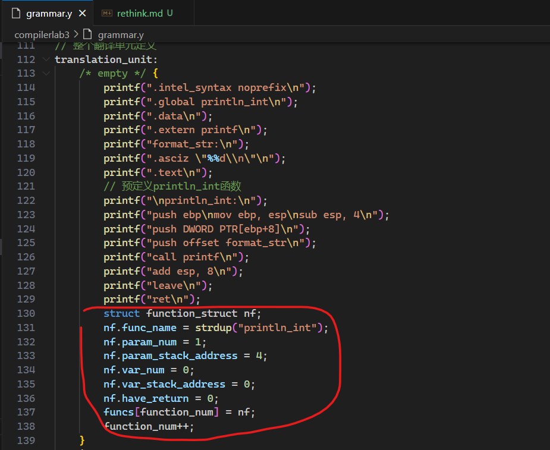
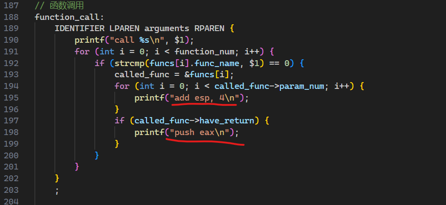

# 实验经验总结

## bug寻找

### lab3

#### 函数调用bug

解决了1+fun()和fun() + 1的结果不同的问题

1. println_int内置函数没有预先存储在全局函数表中，添加如下修正

   

2. 函数调用后没有根据参数数量清空之前传入的参数，和回传参数，因为只会返回int变量或者不返回，因此只要根据是否有参数push一次即可，即是计算结果

#### 运算符实现有误

%、&&、||实现有误，这是耗时第二多的，由老师和同学帮助解决的问题

### lab4

1. bug在break和continue匹配有问题，最终发现是if里statements写成了statement，而不是break和continue本身有问题，是if有问题
2. je跳转前面没有加入cmp语句，导致没法判断

## 自动化测试脚本

./test.sh实现，用自己的编译器给出所有输入的汇编结果，并给出汇编编译后的输出，用这个输出和标准输出进行对比，总结那些文件有问题，帮助我最终完成lab4时，只一共花了2h就完成了所有过程，昨晚完成lab3的时候疯狂自行对比真的花了很多时间，开很多窗口不好，以后要先写测试脚本，再实现/找bug，不要手动找，开很多窗口，批量寻找不同的事情不用手动做，浪费时间也看不全，如果早一点写这个脚本就不会找不到%的bug了，有了这个脚本后lab4中很快就锁定了bug在break和continue匹配有问题，最终发现是if里statements写成了statement，只能匹配一句话。

```shell
#!/usr/bin/env fish
# 复制到build文件夹执行

# Directory for the standard outputs
set standard_output_dir "../../answers"

# Loop through e01.c to e08.c
for i in (seq -w 1 8)
    set filename "../../input/e0$i.c"

    # Step 1: Compile .c file to res.s using Compilerlab3
    echo "Compiling $filename to res.s"
    ./Compilerlab4 $filename > ans/res$i.s
    if test $status -ne 0
        echo "Compilation failed for $filename"
        continue
    end

    # Step 2: Compile res.s to executable res using gcc
    echo "Compiling res.s to executable res$i"
    gcc -m32 -no-pie -g ans/res$i.s -o res
    if test $status -ne 0
        echo "GCC compilation failed for $filename"
        continue
    end

    # Step 3: Run the executable res
    echo "Running executable res"
    ./res > ans/$i.output
    if test $status -ne 0
        echo "Execution failed for $filename"
        continue
    end

    # Step 4: Compare outputs
    set expected_output_file "$standard_output_dir/e0$i.ans"
    diff ans/$i.output $expected_output_file > /dev/null
    if test $status -ne 0
        echo "Output mismatch for $filename"
    else
        echo "Output match for $filename"
    end
end

# Summary of mismatched outputs
echo "Summary of mismatched outputs:"
for i in (seq -w 1 8)
    set expected_output_file "$standard_output_dir/e0$i.ans"
    diff ans/$i.output $expected_output_file > /dev/null
    if test $status -ne 0
        echo "Output mismatch for e0$i.c"
    end
end
```

## 更多可改进的点

具体实现不要在bison里做，优点如下：

1. 方便调试，看到具体执行在哪里的bison子叶出问题
2. 可以很方便自然的使用c++特性

### 碎碎念版

1. 如果能调试bison文件就好了，那么所有的问题只要调试一遍就能找到，而不是只能肉眼找，靠运气，例如找到statement和statements这个区别，真的纯运气，但是对bison文件没法打断点，更好的解决办法：具体在节点内要实现的函数都调用外部函数，在另一个文件中实现，通过cmake调试项目的方式找bug（这个办法可能我会在lab4最后无论如何都无法找到bug的时候使用，不过说实话，在lab3的时候就可以使用了，但是前提是对汇编有足够的熟悉，知道在此时该打印什么才行，所以lab3用的可能性不大），所以以后进行bison联合编程的时候，不要在bison里写具体要实现什么。
2. bison可以编译成cpp，使用具体实现在另外的cpp文件中即可使用c++的方便特性，同时也方便调试发现问题在哪。